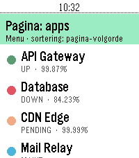
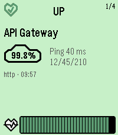
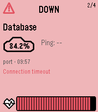

# PebbleKuma

A Pebble Time 2 watchapp that shows your [Uptime Kuma](https://github.com/louislam/uptime-kuma)
status-page monitors on the wrist. Clean white list, status-colored monitor
cards, and a `#5cdd8b` accent with the Uptime Kuma bear as the app icon.

<p>
  
  
  
</p>

## Features

- **Monitor list** — white, readable rows: a status dot (green = up, red = down,
  yellow = pending, blue = maintenance), the name, and the 24h uptime. Scroll
  with up/down.
- **Monitor cards** — select a monitor for a card whose **background is a soft
  pastel of its status** (mint / melon / yellow / sky). Each card shows a vector
  status icon (♥ up / ⚠ down / ? pending / ⟳ maintenance), the name, a cloud
  badge with the 24h uptime %, current ping with min/avg/max, type, last-checked
  time, the last message (on problems), and a heartbeat bar graph behind an HR
  icon. **Up/down pages between cards** in the current sort order.
- **Animated** — the uptime % counts up and the heartbeat bars sweep in
  left-to-right, both on entry and when paging between cards.
- **Sorting** — by page order, name, or status (problems first: down → pending →
  maintenance → up, then lowest uptime first). Set a default in settings, switch
  on the fly in-app.
- **Clear empty states** — *"Niet ingesteld"* (open settings) vs *"Geen
  verbinding"* (configured but the fetch failed — e.g. VPN/network).
- Top list row is the **menu** — Select opens an ActionMenu with a "Sorteren"
  submenu and all configured status pages (long-press Select works anywhere too).

## Settings (Clay)

Open the app settings in the Pebble phone app:

- **Base URL** — e.g. `https://status.company.com`
- **Status pages** — comma-separated slugs, e.g. `monitoring,public`
- **Default page** — the slug shown on launch (falls back to the first)
- **Language** — Nederlands / English / Deutsch / Français (the settings page and
  the whole watch UI follow the choice)
- **Sort by** — page order / name / status (also switchable in-app)

The phone-side JS fetches `{base}/api/status-page/{slug}` and
`{base}/api/status-page/heartbeat/{slug}`, aggregates per monitor (name, latest
status, 24h uptime, recent heartbeats, ping) and streams the result to the watch
one message at a time (throttled per ACK so the inbox buffer never overflows).

## Building & running

```sh
pebble clean && pebble build          # clean is required after resource changes
pebble install --emulator emery       # install on the emery emulator
pebble install --cloudpebble          # install to a real PT2 via Dev Connect
```

## Project layout

```
src/c/pebblekuma.c     main, window stack, AppMessage open
src/c/config.{c,h}     fixed accent + language/sort persist + AppMessage inbox/outbox
src/c/data.{c,h}       monitor/page model + status colors & pastels + sorting
src/c/i18n.{c,h}       NL/EN/DE/FR string table for the watch UI
src/c/monitor_list.c   MenuLayer + StatusBarLayer + page ActionMenu
src/c/monitor_detail.c card deck: pastel background, animated %, heartbeat sweep
src/pkjs/index.js      Clay + Uptime Kuma fetch/aggregate/stream
src/pkjs/i18n.js       per-language Clay settings-form builder
resources/icons/       vector status icons + cloud + HR pulse
resources/images/      bear menu icon (25x25)
marketing/             app-store icons (80x80, 144x144)
```

## Documentation

Full SDK docs: <https://developer.repebble.com>
